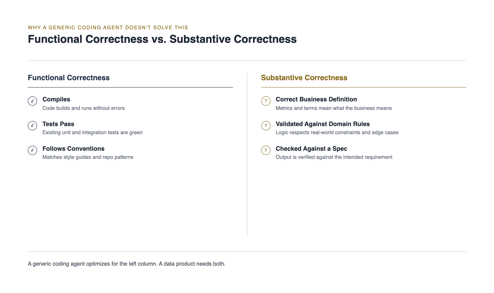
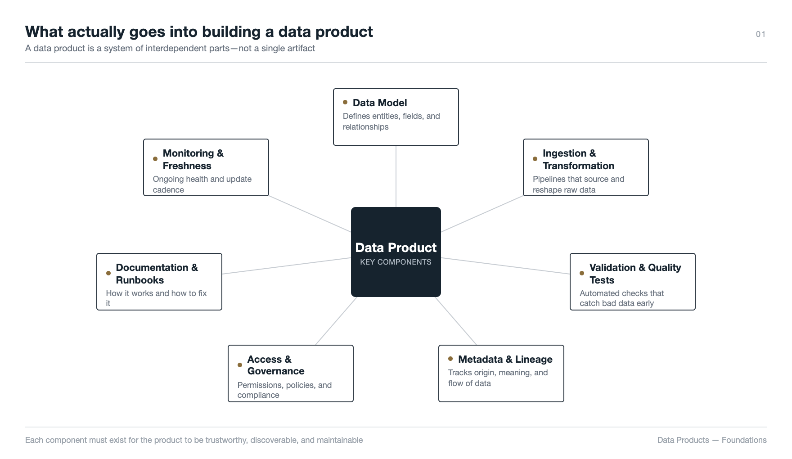
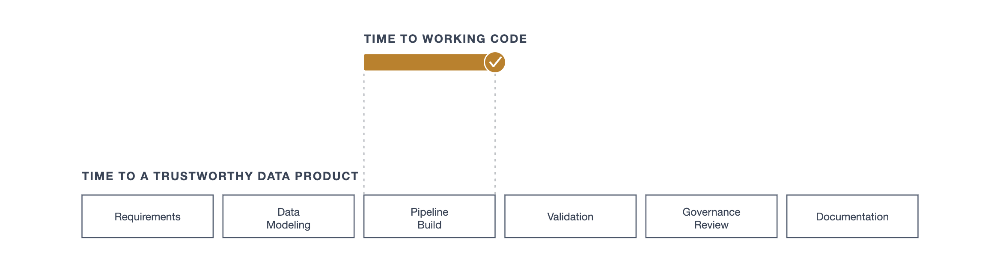
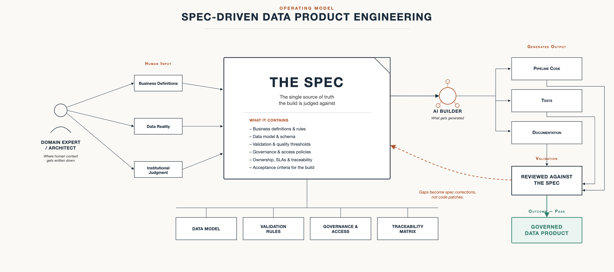

# Spec-Driven Data Product Engineering: Part 1, Why It Matters and Why Now

*Part 1 of 2. This piece makes the case for spec-driven data product engineering. Part 2 goes inside a real build: what a spec actually has to carry, how the process runs end to end, and what a working proof of concept showed.*

A data team writes a solid-looking requirements document for a customer analytics pipeline: source tables, key metrics, a rough definition of "active customer." They hand it to a general-purpose AI coding agent, expecting the document to do what a good requirements doc always did: get the build to the right answer. The agent reads it, builds a pipeline in an afternoon, passes its own tests, and ships a dashboard that looks sharp. Three weeks later, in a leadership review, someone asks why the "active customer" count doesn't match the number Finance has been using all year. It turns out the document specified a 90-day lookback for one metric and never specified the window for this one, a gap a senior engineer would have caught and gone back to clarify. The agent didn't flag it. It picked a reasonable-looking interpretation and built confidently on top of it. Nobody in the room can point to a decision that says that choice was right, because nobody ever made that decision. The agent quietly made it for them.

That's the more realistic version of this problem, and it's worth being precise about it: this isn't a story about nobody writing anything down. Something was written down. It just wasn't precise enough to be built from literally, and nothing in the process checked the finished build against it before it reached a stakeholder. Handing a generic coding agent a document is not the same thing as running a spec-driven build, and that gap is exactly where the risk lives.

## Why a generic coding agent doesn't solve this

It's tempting to assume the fix is simply "write something down and hand it to the agent," the way the team in the opening did. That's closer, but it still isn't enough, and the reason matters. A general-purpose coding agent is built and evaluated against a fairly narrow bar: does the code compile, do the tests pass, does it follow reasonable conventions. That bar is sufficient for most software, where correctness is a property of behavior: a function either returns the right value or it doesn't, and a test catches the difference.

A data product breaks that bar in a specific way. A pipeline can be functionally flawless (clean code, green tests, sensible structure) and still be *substantively* wrong, because it encodes the wrong definition of the business. Some agents can flag ambiguity when asked to. Few workflows actually ask them to, and fewer still stop the build until a human answers. A generic agent handed an imprecise document, left to its default behavior, doesn't fail loudly. It fills the gap with a reasonable-looking guess and keeps going, the same way it did in the opening. And once it's built, nothing in most processes forces anyone to check the result against the document before it reaches a dashboard.

*Passing tests and clean code prove the pipeline runs. They don't prove it means what the business needs it to mean.*

That's the case for treating this as a discipline problem, not just a documentation problem or a tooling problem. It takes both a spec precise enough to be built from literally, and a process that checks the build against it before anyone trusts the output. Neither one alone closes the gap.

## What actually goes into building a data product

Part of why that gap is so easy to fall into is that "build the pipeline" undersells how much a data product actually requires. A working, trustworthy data product isn't one artifact. It's several, each with its own logic and its own way of going wrong:

- **A data model:** entities, relationships, grain, and keys, which determine whether a number even means what it claims to mean
- **Ingestion and transformation logic:** how raw data becomes something usable, and every rule applied along the way
- **Validation and quality tests:** not just "does the pipeline run" but "is this record actually correct," checked against real business rules
- **Metadata and lineage:** what a field means, where it came from, and what changed it, so a number can be explained months later by someone who didn't build it
- **Access and governance controls:** who can see what, what needs masking, and which regulatory boundaries apply
- **Documentation and runbooks:** how to operate, troubleshoot, and extend the product without the original builder in the room
- **Monitoring and freshness guarantees:** how anyone knows the product is still correct after the day it shipped, not just on the day it was demoed

*A pipeline is one of seven components. Generating it fast doesn't make the other six exist on their own.*

A generic coding agent, or a human engineer working from a thin requirements doc, can generate pipeline code quickly. The rest, the data model's rigor, validation, metadata, governance, documentation, monitoring, is where the real work sits, and where the real risk lives.

## The time problem

Each of those seven components, the data model, the pipeline itself, validation, metadata, governance, documentation, monitoring, tends to have its own owner, its own review cycle, and its own dependency on the one before it: the data model has to be validated before the pipeline gets built, the pipeline has to be trusted before governance signs off, and governance has to sign off before anything reaches a stakeholder. That dependency chain, not the coding itself, is why data products have traditionally taken so long to design, build, and deliver. Weeks turn into months, and most of that time isn't spent writing code. It's spent in the coordination between components that were never fully specified up front, so every handoff becomes a fresh negotiation about what was actually meant.

*AI compresses the coding step. The other six components still have to happen, whether or not anyone can see them happening.*

This is the pressure AI agents are being brought in to relieve, and it's exactly where doing it carelessly makes things worse, not better. An agent can compress the coding step from weeks to hours. It cannot compress the modeling, validation, governance, and documentation work that made the old process slow in the first place. That work still has to happen. If it isn't captured in a spec the agent can build from, it doesn't happen faster. It either doesn't happen at all, or it happens after the fact, in production, in front of the client or the board asking why the numbers don't match.

## The gap isn't "no spec." It's "spec written for the wrong reader."

Most data products aren't built with nothing written down. BRDs get written, tickets get filed, design gets reviewed, at least in organizations with any real engineering maturity. The idea that data teams generally work ad hoc, with no spec at all, doesn't hold up as the common case.

The real gap is who that spec was written for. It was written to get sign-off from a stakeholder: readable enough for a business sponsor, precise enough for an engineer to start from. And that worked, because the engineer reading it could fill in the gaps. A vague requirement like "flag high-risk patients" gets resolved by a senior engineer who's sat in the domain long enough to know what "high-risk" means in practice, what edge cases matter, and which shortcuts are safe to take.

An AI agent doesn't have that judgment. It takes the spec literally, which means the spec has to *be* literal. That's the actual shift underway, and it's a bigger one than it sounds: the spec now has to carry the context a senior engineer used to carry in their head, because there's no longer a person in the loop to quietly fill the gap.

## Why this is harder for data products specifically

Specifying a typical software feature is largely about behavior: given this input, produce this output. Specifying a data product means specifying the data itself, and that's a different and harder problem, for reasons any architect will recognize:

- **The data model carries meaning, not just structure.** What grain is a table at? Which fields are dimensions versus facts? Getting this wrong doesn't throw an error. It silently produces a number that's confidently wrong.
- **Source data is never as clean as the schema implies.** Coded fields with undocumented values, inconsistent formats, and missing reference data mean the real behavior of a system only shows up once you profile the actual data, not the data dictionary.
- **Business context can't be inferred from a schema.** What counts as a valid patient cohort, a completed order, or a churned customer is domain knowledge, not something a table definition encodes.
- **Institutional judgment is the hardest thing to write down.** The edge cases a senior person would "just know" to handle, because they've been burned by them before, are exactly the things a spec has to make explicit: an AI builder has no scar tissue to draw on.

Get it wrong in typical software and a feature misbehaves visibly. Get it wrong in a data product and you get a dashboard that looks correct, gets presented to a client or a board, and is quietly wrong underneath.

## What spec-driven engineering actually is

Put the pieces together and the definition is simple: a spec-driven data product treats the specification as the contract the build is continuously judged against, not a document written once for approval and then abandoned. The build isn't "done" when the code runs. It's done when it satisfies the spec, and every step from spec to build to validation stays traceable.

*The spec is the one artifact both the human and the AI builder are accountable to. The loop back into it is what keeps a gap from becoming production's problem.*

The loop matters more than the linear read suggests. When validation finds a gap, the fix isn't a patch to the code. It's a correction to the spec, followed by a rebuild. That discipline is what keeps the spec authoritative instead of becoming stale documentation within a quarter, and it's what lets an AI agent take on the components listed above (modeling, validation, governance, documentation) without a human quietly re-deriving all of it downstream.

## How this relates to data contracts and spec-driven development

This isn't happening in a vacuum, and it's worth being upfront about what it borrows from. Data contracts, the practice popularized by writers like Chad Sanderson and standardized through projects like the Linux Foundation's Bitol, treat a producer's schema and quality guarantees as a formal agreement with downstream consumers, checked automatically the way dbt's model contracts check it today. Spec-driven development, the discipline behind tools like GitHub's Spec Kit, applies "specification before code" to general software built by AI agents. What's described here sits between the two. A data contract governs the ongoing relationship between systems once a pipeline exists. Spec-driven development governs how AI-built software gets constructed generally. Spec-driven data product engineering is the version of that discipline aimed specifically at getting a data product built correctly the first time, with the kind of validation a data contract would check already designed into how the spec gets reviewed.

## Does this just move the bottleneck?

That raises an obvious question: if the spec now has to carry the judgment a senior engineer used to carry, doesn't writing it become the new bottleneck? Not exactly, and the honest answer has two parts. The first is that the expensive human time moves rather than disappears, from debugging a build after the fact to getting the spec right before one starts. The second part is easy to miss: writing the spec isn't a blank-page exercise either. An agent can profile the actual source schema, draft candidate validation rules from what the data looks like rather than what the documentation claims, and surface the fields and edge cases that look ambiguous, all before a human opens the document. That doesn't take the human out of the loop. It changes what they're doing in it, reviewing, correcting, and approving a first draft of intent, instead of typing out table definitions and business rules from nothing. The bottleneck doesn't disappear, but it shrinks down to the part that was always going to need a person: deciding what "active" actually means, not transcribing a schema anyone could have profiled automatically. Whether that trade actually pays off in practice, not just in theory, is what the proof of concept in Part 2 puts to the test.

## The judgment has to live somewhere

None of this is really a story about AI agents. It's a story about what happens to judgment that used to live quietly in a senior engineer's head: the instinct to stop and ask what "active" actually means, instead of picking an answer and moving on. That judgment doesn't disappear when an agent takes over the build. It just has nowhere left to live except the spec. Write it precisely, check the build against it, and the speed AI promises is real. Skip either step, and the outcome is the same dashboard from the opening, just built faster, and trusted by more people before anyone finds the gap.

One thing worth flagging before moving on: not every AI builder starts from zero. A generic coding agent has no visibility into a data estate until a spec spells it out explicitly, every table, every relationship, every existing rule. A platform-native agent like Databricks' Genie Code is a different case. It already sits inside Unity Catalog, with the schemas, lineage, and governance policies that already exist there in view, so it isn't reconstructing the shape of the data from nothing. That closes part of the gap this piece describes, specifically the part where an agent invents structure simply because nobody told it anything at all. It doesn't close the harder part. Genie Code still has no way to know that "active" means a 90-day lookback for one metric and something different for another, because that's a business judgment, not a catalog fact, and no ontology supplies it for you. What a context-aware agent changes isn't whether a spec is still necessary. It changes what the spec has to spend its words on: less time re-describing a data estate the agent can already see, more time capturing the judgment a senior engineer used to supply.

Part 2 goes inside an actual build: what a real spec has to carry in detail, how the process runs when a pipeline spec and an intelligence-layer spec work together, and what a working proof of concept showed, including where the model held up under real pressure and where it didn't.

## Further reading

- [Data Contracts: Developing Production-Grade Pipelines at Scale](https://www.oreilly.com/library/view/data-contracts/9781098157623/), Chad Sanderson, Mark Freeman, and B.E. Schmidt: the current, book-length treatment of why treating data like a governed contract between producer and consumer matters, and how to actually implement it.
- [dbt Model Contracts](https://docs.getdbt.com/docs/mesh/govern/model-contracts): how one widely used tool actually enforces a data contract at build time.
- [Open Data Contract Standard](https://bitol.io/): the Linux Foundation-backed open standard for defining and versioning data contracts across tools and platforms.
- [GitHub Spec Kit](https://github.com/github/spec-kit): an open-source toolkit for spec-driven software development with AI coding agents, the general-software counterpart to the data-specific argument made here.
- [Genie Code](https://docs.databricks.com/aws/en/genie-code/), Databricks documentation: the official overview of the platform-native agent referenced in this piece's closing section.
- [What's New in Genie Code at Data + AI Summit 2026](https://www.databricks.com/blog/whats-new-genie-code-data-ai-summit-2026), Databricks: covers Genie Ontology, the context layer that gives Genie Code visibility into an organization's tables, metrics, and patterns, directly relevant to the "closes part of the gap, not all of it" argument made above.
